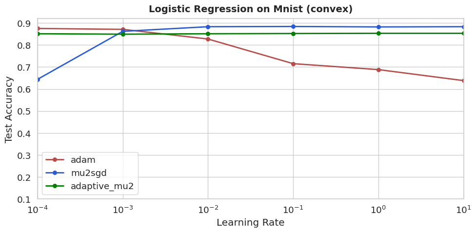
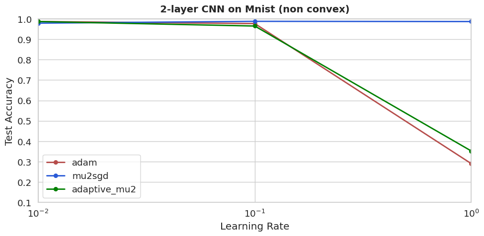
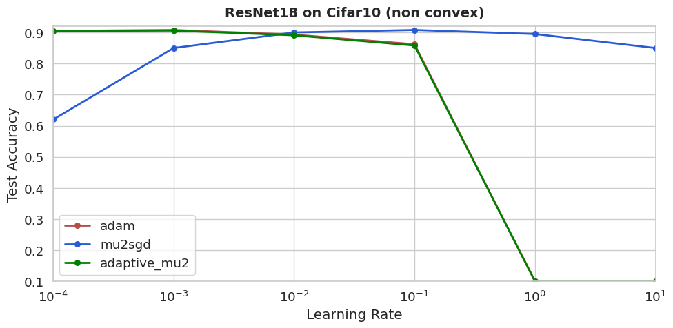

# Adam vs. μ²-SGD, and a New Adaptive μ²-SGD Variant

[](https://opensource.org/licenses/MIT)
---
>This repository is based on the Official repository [**mu2sgd**](https://github.com/dahan198/mu2sgd.git) for the paper 
> "Do Stochastic, Feel Noiseless: Stable Stochastic Optimization via a Double Momentum Mechanism" by Tehila Dahan, Kfir Y. Levy, accepted to ICLR 2025.

## 📌 Overview

This project provides a comprehensive benchmark comparing **Adam** optimizer with the recently proposed **μ²-SGD** optimizer, and introduces a novel **Adaptive μ²-SGD** variant that incorporates RMSprop-style scaling.

Our experiments span both **convex** and **non-convex** optimization settings, evaluating performance across multiple metrics including accuracy, loss convergence, and training stability over diverse learning rate ranges.


## Quick start

### 1. Clone the Repository

```bash
git clone https://github.com/maorgreshler/DL_project_mu2sgd.git
cd DL_project_mu2sgd
```

### 2. Install Dependencies

First, ensure that PyTorch is installed. You can install it by selecting the appropriate command based on your environment from [PyTorch's official website](https://pytorch.org/get-started/locally/).

#### Install Other Dependencies

After installing PyTorch, install the remaining dependencies using:

```bash
pip install -r requirements.txt
```

---

## Running Experiments
Convex Setting - MNIST
```bash
python run_mnist_convex_new.py
```

Non-Convex Setting - MNIST
```bash
python run_mnist_non_convex_new.py
```

Non-Convex Setting - CIFAR-10
```bash
python run_cifar10_non_convex_new.py
```

## 🎯 Research Objectives

- **Benchmark Performance**: Comprehensive comparison of Adam and μ²-SGD across multiple datasets and neural architectures
- **Novel Algorithm**: Design and evaluation of Adaptive μ²-SGD with parameter-specific adaptive scaling
- **Practical Insights**: Analysis of optimizer behavior across different learning rate regimes

## 📚 Background & Motivation

### Adam Optimizer
- Accelerates early training through **parameter-specific adaptivity**
- May exhibit **generalization gaps** compared to SGD in certain training regimes
- Widely adopted but can be unstable with high learning rates

### μ²-SGD Optimizer
The μ²-SGD algorithm combines three key innovations:

- **Anytime Averaging**: Improves online-to-batch conversion guarantees
- **Corrected Momentum (STORM)**: Provides effective variance reduction
- **Shrinking-Error Properties**: Maintains stability across wide learning rate ranges

### Our Adaptive μ²-SGD
We extend μ²-SGD by incorporating **RMSprop-style normalization** to the double-momentum estimator, potentially combining the stability of μ²-SGD with the adaptivity benefits of modern optimizers.

## 🧪 Experimental Setup

### Datasets & Architectures

| Setting | Dataset | Model | Details |
|---------|---------|--------|---------|
| **Convex** | MNIST | Logistic Regression | Unit ℓ₂-ball projection |
| **Non-Convex** | MNIST | SimpleConv | 2 convolutional layers |
| **Non-Convex** | CIFAR-10 | ResNet-18 | 25 epochs, standard augmentation |

**Evaluation Setup:**
- Learning rates: `{10, 1, 0.1, 0.01, 0.001, 0.0001}`
- 3 random seeds per configuration
- Comprehensive logging with Weights & Biases

## 📊 Key Results

### Convex Setting - MNIST Logistic Regression

**Key Finding:** μ²-SGD demonstrates remarkable stability across wide learning rate ranges, while Adam struggles with high learning rates. Adaptive μ²-SGD shows mixed performance - slightly worse than μ²-SGD at most learning rates but superior at very low learning rates.


### Non-Convex Setting - MNIST SimpleConv  

**Key Finding:** μ²-SGD maintains its stability characteristics but shows no clear advantage over Adam. Adaptive μ²-SGD exhibits behavior patterns similar to Adam optimizer.
| 

### Non-Convex Setting - CIFAR-10 ResNet-18

**Key Finding:** μ²-SGD excels at extremely high learning rates (LR=10), though such rates are uncommon in practice. Adam and Adaptive μ²-SGD perform nearly identically, both excelling at lower learning rates.
| 

## ✅ Conclusions

1. **μ²-SGD** offers robust learning rate stability and could serve as a viable alternative to Adam when computational costs are comparable
2. **Adaptive μ²-SGD** did not demonstrate significant performance improvements over the base μ²-SGD algorithm
3. **Optimizer choice** should consider the specific learning rate regime and computational constraints

## ⚙️ Hyperparameters

| Parameter | Value | Description |
|-----------|-------|-------------|
| **Learning Rates** | `{10, 1, 0.1, 0.01, 0.001, 0.0001}` | Comprehensive LR sweep |
| **Momentum (μ²-SGD)** | γ=0.1, β=0.9 | Non-convex settings |
| **RMS Decay** | ρ=0.99 | Adaptive μ²-SGD second moment |
| **Epsilon** | 1e-8 | Numerical stability |

## 🖥️ Logging & Monitoring

This repository supports comprehensive experiment tracking with **Weights & Biases**.

**Setup Configuration:**
```yaml
# wandb.yaml
project: "mu2sgd_experiments" 
entity: "your-wandb-username"
```

## 📜 Citation

If you use this code or findings in your research, please consider citing the original paper:

```bibtex
@inproceedings{dahan2025mu2sgd,
  title={Do Stochastic, Feel Noiseless: Stable Stochastic Optimization via a Double Momentum Mechanism},
  author={Tehila Dahan and Kfir Y. Levy},
  booktitle={International Conference on Learning Representations},
  year={2025}
}
```

---

<div align="center">

**Questions or suggestions?** Feel free to open an issue or submit a pull request!

</div>